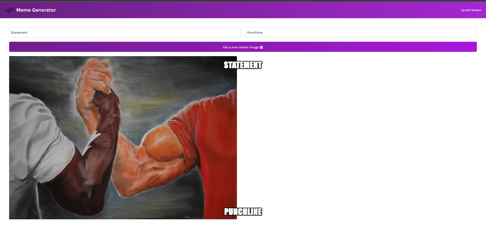
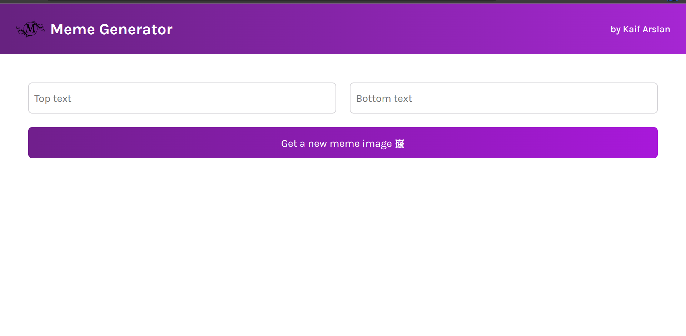

# Meme Generator

This is a project that allows you to create memes with images and text.
This project is made with vite + react with Javascript (vanilla)

## How to use

To use this project, you need to:

- Clone or download this repository
- Install the required dependencies
- Run the npm install , npm run dev start command
- Open the web browser and go to http://localhost:3000
- Enjoy creating memes!

## Examples

Here are some examples of memes created with this project:

## Credits

This project was created by Kaif Arslan using React, in the course "learning React" (scrimba).
